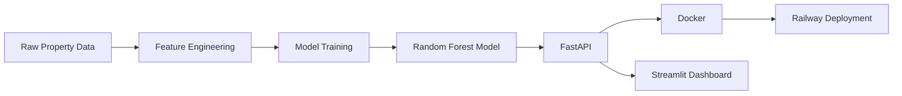
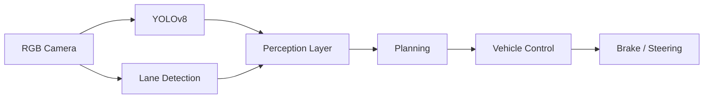
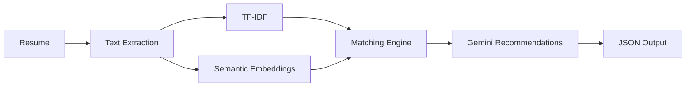

<div align="center">


<br>


<br>

<div align="center">


</div>

# Devendra Kushwah

### Machine Learning Engineer • MLOps • Computer Vision

🎓 **B.Tech CSE (AI & ML)** • CGPA **9.24** • IPS Academy, Indore

🏆 OCI Generative AI Professional • 🌍 Open Source Contributor • 💼 AI/ML Intern

---

## 🚀 Highlights

<table>
<tr>
<td>🏆 OCI Generative AI Professional</td>
<td>📈 CGPA 9.24</td>
</tr>
<tr>
<td>🌍 Docker Docs Contributor</td>
<td>🌍 scikit-image Contributor</td>
</tr>
<tr>
<td>💼 AI/ML Engineering Intern</td>
<td>🤖 Production AI Systems</td>
</tr>
</table>

---

## 🧠 About Me

I build end-to-end machine learning systems spanning data pipelines, model development, deployment infrastructure, and production serving.

My work focuses on Machine Learning, Computer Vision, MLOps, Retrieval-Augmented Generation (RAG), Agentic AI, and scalable AI infrastructure.

I enjoy transforming ideas into production-ready systems through engineering-first design, reproducible workflows, automation, and deployment.

---

## ⚡ Tech Stack

### Languages


### Machine Learning


### Computer Vision


### NLP & GenAI


### MLOps & Infrastructure


---

## 🏗️ Infrastructure & System Design

```text
User
  ↓
API Gateway
  ↓
FastAPI Service
  ↓
Redis Cache
  ↓
ML Inference Layer
  ↓
Model Registry
  ↓
Storage
```

### Engineering Areas

- Docker & Containerization
- Kubernetes Orchestration
- Redis Caching
- AWS Cloud Services
- Linux Infrastructure
- REST API Design
- CI/CD Automation
- Model Serving Systems
- Scalable AI Architecture
- Microservices Concepts

---
## 🚀 Featured Projects

### 🏠 EstateIQ — Gurgaon Real Estate ML Platform

End-to-end production machine learning platform for property valuation and intelligent recommendations.

### Architecture



### Key Metrics

| Metric | Value |
|----------|----------|
| Model R² | 0.821 |
| MAE | 0.53 Cr |
| RMSE | 1.17 Cr |
| Properties Covered | 15,000+ |
| Recommendation Corpus | 247+ Projects |
| API Latency | <120ms |

### Highlights

- Random Forest selected after benchmarking Linear Regression, Ridge, Lasso and XGBoost
- TF-IDF recommendation engine with budget, location and BHK filtering
- FastAPI inference service with structured APIs
- Interactive Streamlit + Mapbox frontend
- Dockerized deployment with GitHub Actions CI/CD

**Tech Stack**

`Python` • `Scikit-learn` • `FastAPI` • `Docker` • `Streamlit` • `Railway`

---

### 🚗 Autonomous Driving Simulation

Real-time Perception → Planning → Control pipeline built using CARLA.

### Architecture



### Highlights

- YOLOv8 object detection
- Real-time lane detection
- Collision warning & emergency braking
- RGB + LiDAR sensor fusion
- Multi-class object recognition
- 30+ FPS inference pipeline

**Tech Stack**

`Python` • `YOLOv8` • `OpenCV` • `CARLA` • `PyTorch`

---

### 📄 AI Resume Analyzer

NLP-powered resume screening and JD matching system.

### Architecture



### Highlights

- TF-IDF + semantic similarity scoring
- Skill-gap detection engine
- Gemini-powered recommendations
- PDF/DOCX processing pipeline
- REST API architecture

**Tech Stack**

`Python` • `NLP` • `FastAPI` • `Gemini API` • `Hugging Face`

---

## 💼 Experience

### AI/ML Engineering Intern

- Built supervised learning pipelines
- Performed hyperparameter optimization
- Developed production inference APIs
- Implemented validation and deployment workflows
- Worked on model experimentation and evaluation

### AI for Sustainability Intern

- Developed RAG-based retrieval systems
- Designed agentic AI workflows
- Evaluated responsible AI metrics
- Conducted factuality and bias assessments
- Built context-aware retrieval pipelines

---

## 🌍 Open Source Contributions

<div align="center">

| Repository | Contribution | Status |
|------------|-------------|--------|
| docker/docs | Documentation fixes & improvements | ✅ Merged |
| scikit-image/scikit-image | Bug fixes & documentation enhancements | ✅ Merged |

</div>

### Focus Areas

- Documentation Quality
- Developer Experience
- Reproducibility
- Open Source Tooling
- ML Ecosystem Contributions

---

## 🏆 Certifications & Recognition

| Certification | Issuer |
|---------------|--------|
| OCI Generative AI Professional | Oracle |
| OCI Data Science Professional | Oracle |
| Machine Learning Professional Certificate | IBM |
| Career Essentials in Generative AI | Microsoft & LinkedIn |

### Recognition

🏆 Oracle Certified Professional

🌍 Open Source Contributor

💼 AI/ML Engineering Internship Experience

🎓 CGPA 9.24

---

## 🔭 Currently Building

- 🚁 Autonomous Disaster Response Drone (AirSim + Reinforcement Learning)
- 🤖 Agentic AI Workflows with LangGraph
- 🔎 Production RAG Pipelines
- ⚙️ MLOps Monitoring & Deployment Systems
- 📦 Open Source Contributions
- 📚 Advanced DSA & Problem Solving

---

## 📈 GitHub Activity

<div align="center">


</div>

---

## 📊 GitHub Statistics

<div align="center">


<br>


</div>

---

## 📫 Connect With Me

<div align="center">

<a href="https://www.linkedin.com/in/devendrakushwah80">

</a>

<a href="https://www.kaggle.com/devendrakushwah08">

</a>

<a href="mailto:dk3313250@gmail.com">

</a>

<a href="https://github.com/devendrakushwah80">

</a>

</div>
